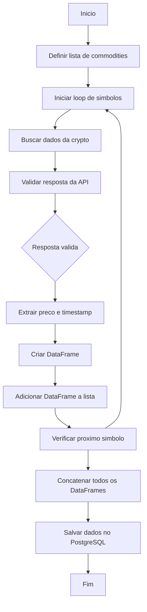

#Constução de app de teste

```mermaid
flowchart TD;
    A[Inicio] 
    A --> B[Definir lista de commodities]
    B --> C[Iniciar loop de simbolos]
    C --> D[Buscar dados da crypto]
    D --> E[Validar resposta da API]
    E --> F{Resposta valida}
    F --> G[Extrair preco e timestamp]
    G --> H[Criar DataFrame]
    H --> I[Adicionar DataFrame a lista]
    I --> J[Verificar proximo simbolo]
    J --> C
    J --> K[Concatenar todos os DataFrames]
    K --> L[Salvar dados no PostgreSQL]
    L --> M[Fim]
```